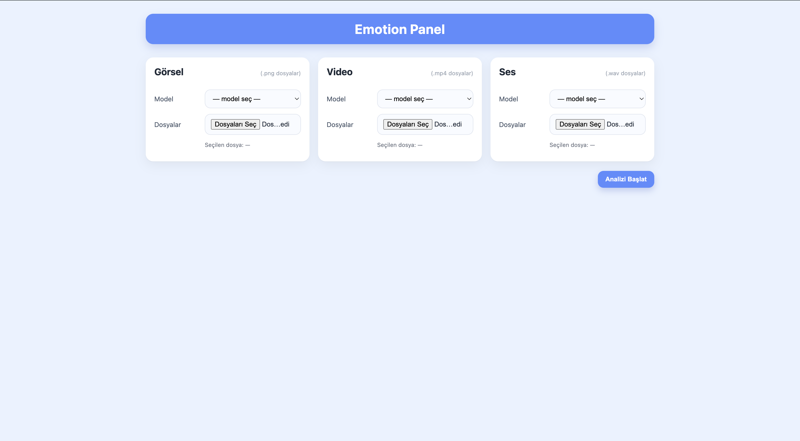
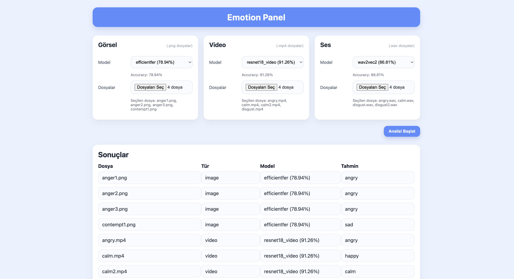

# Emotion Panel

Görsellerden, videolardan ve ses dosyalarından **duygu analizi** yapan tam kapsamlı panel.  
Proje **FastAPI backend** ve **React frontend** ile geliştirilmiştir.

<p align="center">
  
</p>

---

## Özellikler
- **Çoklu modalite desteği**:
  - **Image** → GoogLeNet, EfficientFER, FERFormer, MobileViT, AlexNet (Fast R-CNN)
  - **Video** → ResNet18 (RAVDESS tabanlı)
  - **Audio** → Wav2Vec2 (RAVDESS tabanlı)
- **Hugging Face Hub entegrasyonu**  
  - Yerelde model bulunmazsa otomatik olarak HF’den indirir.
  - Büyük dosyalar repo’da tutulmaz → depolama sorunu yok.
- **React arayüz**  
  - Dosya yükleme, model seçimi ve sonuç görüntüleme.
- **FastAPI backend**  
  - Basit, hızlı ve CORS uyumlu REST API.
- **Test seti**  
  - `test/image`, `test/video`, `test/audio` klasörlerinde örnekler.

<p align="center">
  
</p>

---

## Kurulum

### 1) Backend
```bash
cd backend
pip install -r ../requirements.txt
uvicorn main:app --reload

```
### 2) Frontend
```bash
cd emotion-panel-ui
npm install
npm start
```
Backend: http://127.0.0.1:8000

Frontend: http://localhost:3000

Not: Model ağırlıkları yerelde yoksa kod, Hugging Face Hub’dan otomatik indirir.
Sadece HF’den indirmek isterseniz:
```bash
export USE_HF_ONLY=1
```


**Model Ağırlıkları (Hugging Face)**
Kod, modelleri yerelde bulamazsa aşağıdaki public repolardan otomatik indirir:
- [nurselidemir/emotion-googlenet-fer2013plus](https://huggingface.co/nurselidemir/emotion-googlenet-fer2013plus)
- [nurselidemir/emotion-alexnet-fast-rcnn-fer2013plus](https://huggingface.co/nurselidemir/emotion-alexnet-fast-rcnn-fer2013plus)
- [nurselidemir/emotion-ferformer-fer2013plus](https://huggingface.co/nurselidemir/emotion-ferformer-fer2013plus)
- [nurselidemir/emotion-efficientfer-keras](https://huggingface.co/nurselidemir/emotion-efficientfer-keras)
- [nurselidemir/emotion-mobilevit-fer2013plus](https://huggingface.co/nurselidemir/emotion-mobilevit-fer2013plus)
- [nurselidemir/emotion-resnet18-ravdess-video](https://huggingface.co/nurselidemir/emotion-resnet18-ravdess-video)
- [nurselidemir/emotion-wav2vec2-ravdess-audio](https://huggingface.co/nurselidemir/emotion-wav2vec2-ravdess-audio)

### Modeller & Performans

Accuracy değerleri /models/performance ve backend’deki MODEL_PERFORMANCE ile tutarlı tutulur.
| Model key      | Modalite | Dataset                | Accuracy (%) |
|----------------|----------|------------------------|--------------|
| googlenet      | Image    | Fer2013Plus            | 81.84        |
| efficientfer   | Image    | Fer2013Plus            | 78.94        |
| ferformer      | Image    | Fer2013Plus            | 72.47        |
| fast_rcnn      | Image    | Fer2013Plus            | 81.11        |
| mobilevit      | Image    | Fer2013Plus            | 81.76        |
| resnet18_video | Video    | RAVDESS speech video   | 91.26        |
| wav2vec2       | Audio    | RAVDESS speech audio   | 86.81        |


## API

### 1) Modelleri Listele
**GET** `/models`  

Örnek yanıt:
```json
{
  "image": [
    {"name": "googlenet", "accuracy": "81.84%"}
  ],
  "video": [
    {"name": "resnet18_video", "accuracy": "91.26%"}
  ],
  "audio": [
    {"name": "wav2vec2", "accuracy": "86.81%"}
  ]
}
```
### 2) Performans Metrikleri
**GET** `/models/performance`  

Örnek yanıt:
```json
{
  "googlenet": {
    "dataset": "Fer2013Plus",
    "accuracy": "81.84%",
    "train_time": "2385.17s",
    "test_time": "44.08s"
  },
  "fast_rcnn": {
    "dataset": "Fer2013Plus",
    "accuracy": "81.11%",
    "train_time": "1380.10s",
    "test_time": "277.5s"
  },
  "ferformer": {
    "dataset": "Fer2013Plus",
    "accuracy": "72.47%",
    "train_time": "10246.47s",
    "test_time": "83.15s"
  },
  "mobilevit": {
    "dataset": "Fer2013Plus",
    "accuracy": "81.76%"
  },
  "efficientfer": {
    "dataset": "Fer2013Plus",
    "accuracy": "78.94%"
  },
  "resnet18_video": {
    "dataset": "RAVDESS speech video",
    "accuracy": "91.26%"
  },
  "wav2vec2": {
    "dataset": "RAVDESS speech audio",
    "accuracy": "86.81%"
  }
}
```

### 3) Tahmin Alma
**POST** `/predict`  

Form-data ile gönderilmesi gereken alanlar:
- **file** → dosya (desteklenen formatlar: `.png`, `.mp4`, `.wav`)  
- **model_name** → `googlenet | efficientfer | ferformer | fast_rcnn | mobilevit | resnet18_video | wav2vec2`  
- **category** → `image | video | audio`  

Örnek kullanım (cURL):  
```bash
curl -X POST "http://127.0.0.1:8000/predict" \
  -F "file=@test/image/example.png" \
  -F "model_name=googlenet" \
  -F "category=image"
